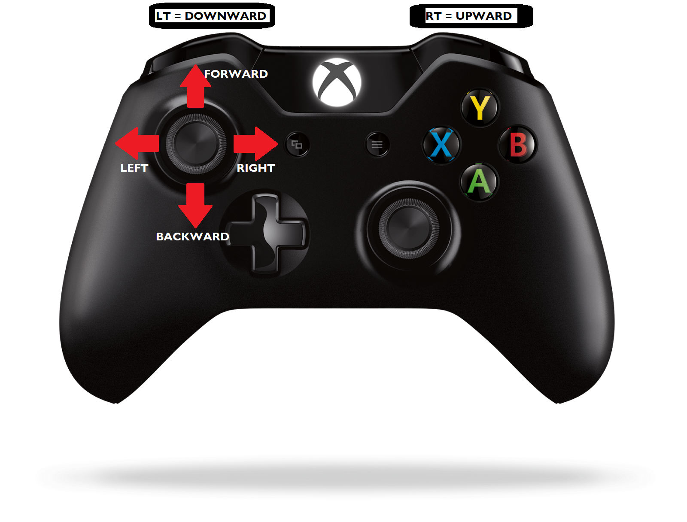
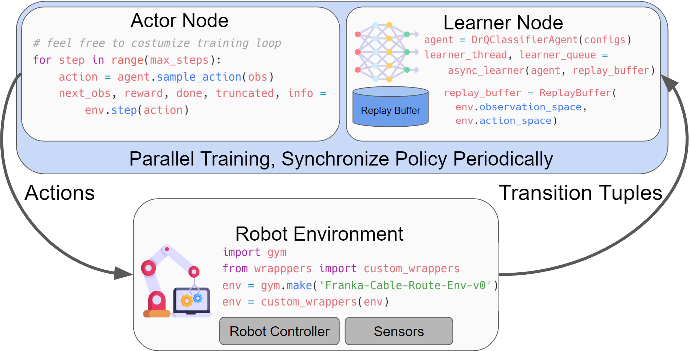

# HIRO HIL-SERL Implementation : Precise and Dexterous Robotic Manipulation via Human-in-the-Loop Reinforcement Learning

<!--  -->


**Webpage: [https://hil-serl.github.io/](https://hil-serl.github.io/)**

HIL-SERL provides a set of libraries, env wrappers and examples to train RL policies using a combination of demonstrations and human corrections to perform robotic manipulation tasks with near-perfect success rates.
This branch contains our own HIL-SERL implementation for UR Robot. The following sections describe how to use such implementation.

🎬:

**Table of Contents**
- [HIL-SERL: Precise and Dexterous Robotic Manipulation via Human-in-the-Loop Reinforcement Learning](#serl-a-software-suite-for-sample-efficient-robotic-reinforcement-learning)
  - [Installation](#installation)
  - [How to run the code](#how-to-run-the-code)
   <!-- - [Contribution](#contribution) -->
    - [Overview and Code Structure](#overview-and-code-structure) 
  - [Citation](#citation)

## Installation
1. **Setup Conda Environment:**
    create an environment with
    ```bash
    conda create -n hilserl python=3.10
    ```

2. **Install Jax as follows:**
    - For CPU (not recommended):
        ```bash
        pip install --upgrade "jax[cpu]"
        ```

    - For GPU:
        ```bash
        pip install --upgrade "jax[cuda12_pip]==0.4.35" -f https://storage.googleapis.com/jax-releases/jax_cuda_releases.html
        ```

    - For TPU
        ```bash
        pip install --upgrade "jax[tpu]" -f https://storage.googleapis.com/jax-releases/libtpu_releases.html
        ```
    - See the [Jax Github page](https://github.com/google/jax) for more details on installing Jax.

3. **Install the serl_launcher**
    ```bash
    cd serl_launcher
    pip install -e .
    pip install -r requirements.txt
    ```

4. **Install for serl_robot_infra** Follow the [README](./serl_robot_infra/README.md) in `serl_robot_infra` for installation and basic robot operation instructions. This contains the instruction for installing the impendence-based [serl_franka_controllers](https://github.com/rail-berkeley/serl_franka_controllers). After the installation, you should be able to run the robot server, interact with the gym `franka_env` (hardware).

5. **Install my_cpp_py_pkg**: (TODO cambiare nome) this package contains some important scripts to use the Xbox Controller and to "Bridge" info from/to the robot to/from Gym enivornment. Find the repository at this link: [my_cpp_py_pkg](https://github.com/claudio-dg/my_cpp_py_pkg/tree/master)
  
## How to run the code
In order to Run the scripts about HIRO HIL-SERL implementation, make sure to type the following commands on the Vecow PC that already contains all the requirements.

Firstly, you'll need several terminals: make sure to open the virtual environment cotaining the required libraries by typing:

```bash
$ source cdg_env/bin/activate
```

Then, you'll need to modify the ROS Middleware for Node communications, this enhances the performances and avoids lag issues, especially if using Mujoco's simulation:

```bash
$ export RMW_IMPLEMENTATION=rmw_cyclonedds_cpp
```
At this point you can launch the main scripts, here follows the instructions to launch the real UR robot example:

Type this to launch the controllers and to connect with the real robot by specifying its IP address:

 ```bash
$ ros2 launch ur_hiro_bringup ur_real_bringup.launch.py robot_ip:=192.168.3.102
```
Launch the script to allow the communication between gym, the robot and external controllers (such as the XBOX Controller)

 ```bash
$ ros2 run my_cpp_py_pkg RealStateBridgeNode.py
```
Launch in a separate terminal the node to extract data from the XBOX Controller:

 ```bash
$ export PYTHONPATH=$PYTHONPATH:/home/claudiodelgaizo/ros/deps/opt/ros/jazzy/lib/python3.12/site-packages
$ ros2 run my_cpp_py_pkg UR_joystick_move.py
```
The following image briefly explains how to use the controller to move the robot. Please note that, for simplicity, it is only possible to move the robot's end effector, but not to rotate it.

<p align="center">
  
</p>


At this point, navigate to the [examples](https://github.com/claudio-dg/hil-serl-hiro/tree/hiro_simulation/examples) folder from your workspace, and launch the desired scripts for training, collecting data or evaluating checkpoints.

For instance, in order to evaluate the performances of the last pre-trained RL agent, you can type this command specyfing the specific checkpoint to evaluate:

 ```bash
$ python3 real_UR_train_rlpd.py --actor --eval-checkpoint-step:=65000
```


## Overview and Code Structure
HIL-SERL provides a set of common libraries for users to train RL policies for robotic manipulation tasks. The main structure of running the RL experiments involves having an actor node and a learner node, both of which interact with the robot gym environment. Both nodes run asynchronously, with data being sent from the actor to the learner node via the network using [agentlace](https://github.com/youliangtan/agentlace). The learner will periodically synchronize the policy with the actor. This design provides flexibility for parallel training and inference.

<!-- <p align="center">
  
</p> -->

**Table for code structure**

| Code Directory | Description |
| --- | --- |
| [examples](https://github.com/claudio-dg/hil-serl-hiro/tree/hiro_simulation/examples) | Scripts for policy training, demonstration data collection, reward classifier training |
| [serl_launcher](https://github.com/claudio-dg/hil-serl-hiro/tree/hiro_simulation/serl_launcher/serl_launcher) | Main code for HIL-SERL |
| [serl_launcher.agents](https://github.com/claudio-dg/hil-serl-hiro/tree/hiro_simulation/serl_launcher/serl_launcher/agents) | Agent Policies (e.g. SAC, BC) |
| [serl_launcher.wrappers](https://github.com/claudio-dg/hil-serl-hiro/tree/hiro_simulation/serl_launcher/serl_launcher/wrappers) | Gym env wrappers |
| [serl_launcher.data](https://github.com/claudio-dg/hil-serl-hiro/tree/hiro_simulation/serl_launcher/serl_launcher/data) | Replay buffer and data store |
| [serl_launcher.vision](https://github.com/claudio-dg/hil-serl-hiro/tree/hiro_simulation/serl_launcher/serl_launcher/vision) | Vision related models and utils |
| [serl_robot_infra](./serl_robot_infra/) | Robot infra for running with real robots |
| [serl_robot_infra.franka_env](https://github.com/claudio-dg/hil-serl-hiro/tree/hiro_simulation/serl_robot_infra/franka_env) (TODO camb nome) | Utils and wrappers for UR robot env |

## XXX 
<!-- ## Run with Franka Arm

We provide a step-by-step guide to run RL policies with HIL-SERL on a Franka robot.

Check out the [Run with Franka Arm](/docs/franka_walkthrough.md)
 - [RAM Insertion](/docs/franka_walkthrough.md#1-ram-insertion)
 - [USB Pickup and Insertion](/docs/real_franka.md#2-usb-pick-up-and-insertion)
 - [Object Handover](/docs/real_franka.md#3-object-handover)
 - [Egg Flip](/docs/real_franka.md#4-egg-flip)-->

<!-- ## Contribution

We welcome contributions to this repository! Fork and submit a PR if you have any improvements to the codebase. Before submitting a PR, please run `pre-commit run --all-files` to ensure that the codebase is formatted correctly. -->

## Citation

If you use this code for your research, please cite our paper:

```bibtex
@misc{luo2024hilserl,
      title={Precise and Dexterous Robotic Manipulation via Human-in-the-Loop Reinforcement Learning},
      author={Jianlan Luo and Charles Xu and Jeffrey Wu and Sergey Levine},
      year={2024},
      eprint={2410.21845},
      archivePrefix={arXiv},
      primaryClass={cs.RO}
}
```

